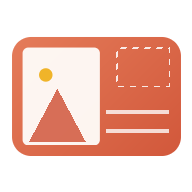

# Postcard Press by [Storitellah](https://storitellah.com)

**A local-first postcard design studio for photographers, artists, galleries, exhibitions, workshops, NGOs, museums and creative storytellers.**

Design professional, print-ready photo postcards — front and back — entirely in your browser. No login. No sign-up. No cloud uploads. No tracking. Your photographs never leave your device.



## ✨ Features

### Design studio
- **Front designer** — full-bleed photographs, gallery borders, editorial layouts, museum labels, wide bottom borders, minimal frames, or fully custom designs
- **Back designer** — a real postcard back with caption, story, photographer credit, copyright, project, website, date, location, address lines, stamp placeholder, divider, optional QR code, logo and free custom text blocks — every element draggable, resizable and recolourable
- **Professional border engine** — equal borders on all four sides, adjustable width and colour, always outside the photograph; photos are never cropped or distorted by the border
- **Aspect ratio preservation** — photos are never stretched, squashed or distorted; intelligent fit and fill with manual crop position, zoom, rotate and reset
- **Photographer credits** — bottom left, bottom right, centre, on the back, or hidden, in standard formats (`Photo: Your Name`, `Photograph by Your Name`, `© Your Name`, `Your Name / Studio`, or custom)

### Print-ready output
- **Sizes** — 4×6 in, 5×7 in, A6, 105×148 mm, 100×150 mm, 127×178 mm, US Postcard, Square, and custom sizes in inches, millimetres or centimetres
- **Portrait and landscape** orientation
- **300 DPI export** with bleed, crop marks, cut marks and safe margins
- **JPG** (maximum quality, 300 DPI header), **PNG** (300 DPI pHYs), and **print-ready PDF**
- **Imposed sheets** — multiple postcards per A4 or Letter page, duplex-ready with mirrored backs for long-edge or short-edge flip
- **Contact sheets** and multi-page PDFs
- **Duplex preview** with alignment guide and printable alignment test page
- **Direct browser printing**

### Batch workflow
- Upload one photo or hundreds — each becomes a postcard, inheriting your current design
- Individual titles, captions, stories, locations and dates per card
- Apply one front or back design to every postcard with one click
- Duplicate, delete and drag-to-reorder in the timeline
- Batch export as a ZIP or a single multi-page PDF
- File naming patterns: `originalname-front.jpg`, `originalname-postcard.pdf`, `project-001.jpg`, or custom patterns with `{name}` `{project}` `{title}` `{index}` `{side}` `{date}` tokens

### Local-first
- Works completely offline (PWA, installable)
- Autosaves your project to your browser (IndexedDB)
- Save/restore full project backups as JSON
- Design presets and credit presets stored locally
- Zero network calls for your content — verified in the codebase: there is no upload code

### Interface
- **Liquid Glass Light** and **Liquid Glass Dark** themes
- Professional workspace: top toolbar, media browser, live preview, settings inspector, postcard timeline
- Live preview modes: Front, Back, Side-by-side, Print sheet, Fullscreen
- Zoom, pan, fit-to-screen, actual print size, guides, bleed and crop mark overlays
- Touch-first mobile UI: swipe to flip, pinch to zoom, drag to position — optimised for iPhone, iPad and Android
- Keyboard shortcuts, screen reader labels, focus states, reduced-motion and high-contrast support

## 🚀 Getting started

### Use it
Open `index.html` in any modern browser — that's it. Or serve the folder:

```bash
# any static server works
npx serve .
# or
python3 -m http.server 8000
```

Then open `http://localhost:8000`. Click **Try the demo project** to explore with sample postcards, or **Upload photos** to start with your own work.

### Install as an app
Postcard Press is a PWA. In Chrome/Edge/Safari, use "Install app" / "Add to Home Screen" and it will work fully offline.

### Deploy it
See [DEPLOYMENT.md](DEPLOYMENT.md) — the project is a plain static site, ready for GitHub Pages, Cloudflare Pages, Netlify, or any web server.

## ⌨️ Keyboard shortcuts

| Key | Action |
| --- | --- |
| `Ctrl/⌘ + Z` / `Ctrl/⌘ + Shift + Z` | Undo / redo |
| `Ctrl/⌘ + S` | Save project backup (JSON) |
| `Ctrl/⌘ + P` | Print |
| `F` / `B` | Front / back |
| `←` / `→` | Previous / next postcard |
| `+` / `−` / `0` / `1` | Zoom in / out / fit / actual size |
| `G` | Toggle guides |
| `T` | Toggle theme |
| `↑` `↓` `←` `→` | Nudge selected back element (Shift = bigger steps) |
| `Delete` | Hide / delete selected back element |

## 📁 Repository structure

```
index.html            App shell
styles.css            Liquid Glass design system, themes, print styles
script.js             The entire studio: renderers, export engine, PDF/ZIP/QR writers
manifest.json         PWA manifest
service-worker.js     Offline cache
favicon.svg           Vector icon
icons/                PNG app icons (192/512/maskable/apple-touch/favicon)
samples/              Sample exports produced by the automated test suite
README.md             This file
DEPLOYMENT.md         Hosting guide (GitHub Pages, Cloudflare Pages, …)
PRINTING-GUIDE.md     Paper, bleed, duplex and print-shop guidance
TESTING.md            Test plan + automated test report
PRIVACY.md            The short version: everything stays on your device
CHANGELOG.md          Version history
```

No build step. No dependencies. Lightweight vanilla HTML, CSS and JavaScript.

## 🖨 Printing

Read [PRINTING-GUIDE.md](PRINTING-GUIDE.md) for paper stock recommendations, bleed and safe margin explanations, duplex alignment testing, and instructions for professional print shops.

## 🔒 Privacy

Everything happens locally in your browser. See [PRIVACY.md](PRIVACY.md).

## ❤️ Support the Creator

Postcard Press is made with love by [Storitellah](https://storitellah.com).

- 🧡 **Patreon** — <https://patreon.com/kiberastories>
- ☕ **Ko-fi** — <https://ko-fi.com/kiberastories>
- 🐞 **Bug reports** — <brian@storitellah.com>

## License

© Storitellah. Free to use for creating your postcards. Contact <brian@storitellah.com> about other uses.
